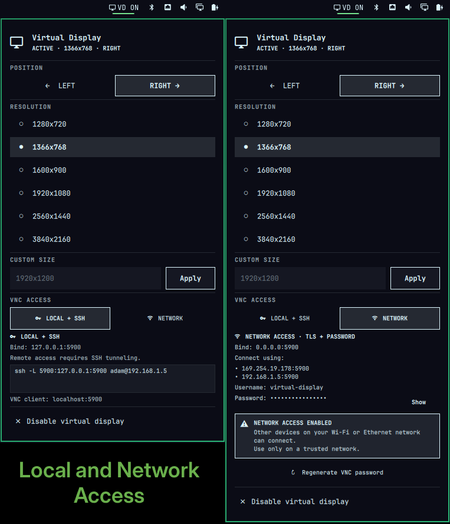
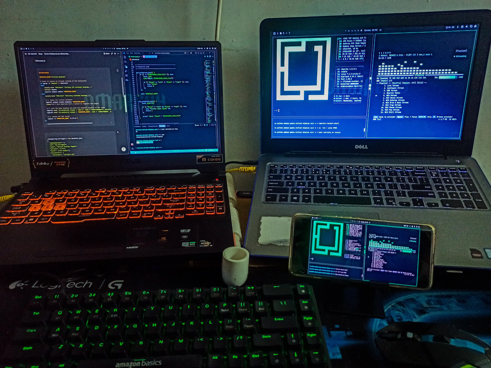
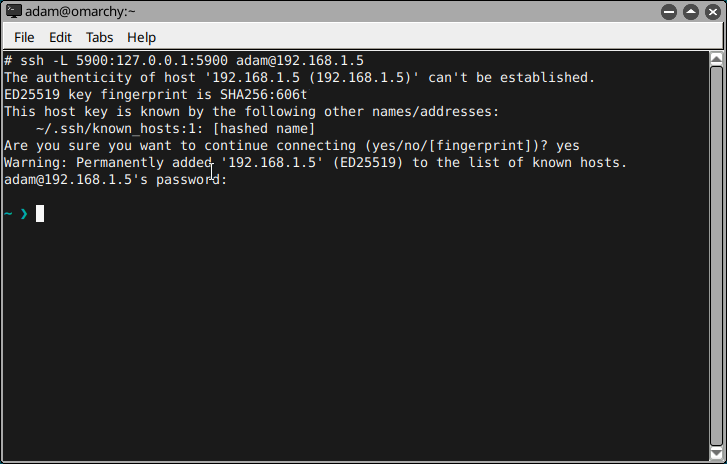
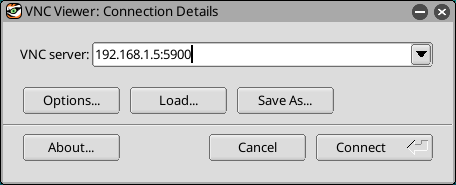
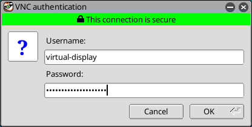
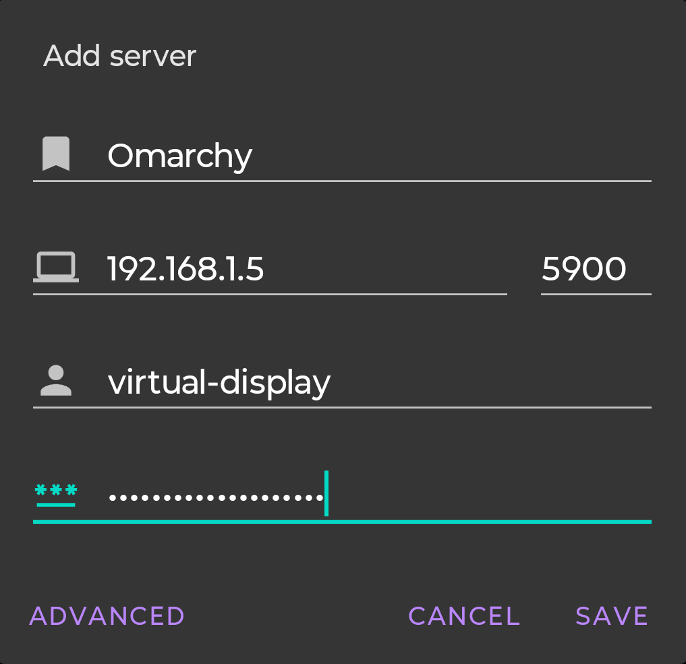

# omarchy-virtual-display

A lightweight Omarchy bar plugin for creating and managing a virtual headless display through Hyprland and WayVNC.

<div align="center">

</div>

## Use Your Virtual Display Anywhere

Create a virtual display from the Omarchy bar and stream it through VNC to another computer, laptop, tablet, or Android device.

The plugin supports both **Wi-Fi and Ethernet** networking when Network Access is explicitly enabled.



## Features

- Create a virtual display from the Omarchy bar
- Preset resolutions
- Custom resolutions
- Place the virtual display to the left or right
- Automatically detect the main display
- Preserve the main display's resolution, scale and transform
- Automatically calculate the virtual display position
- Start and stop WayVNC with the virtual display
- Secure local-only VNC mode by default
- Optional network access with VNC password authentication and TLS
- Regenerate the Network Access password from the panel
- CLI support for scripting and terminal usage

## Requirements

This plugin is designed for **Omarchy Quattro / v4** and requires:

- [Omarchy](https://omarchy.org/)
- [Hyprland](https://hyprland.org/)
- [WayVNC](https://github.com/any1/wayvnc)
- `jq`
- `openssl`


Install the external dependencies with:

```bash
sudo pacman -S wayvnc jq openssl
```

>[!NOTE]
>The plugin does **not** install system packages automatically.
>
> This keeps package installation and privileged system changes outside the plugin. The plugin only uses the dependencies when they are already installed.


## Install

```sh
omarchy plugin add https://github.com/adamya-gupta/omarchy-virtual-display.git --enable
```

PLUGIN ID: `io.github.adamya-gupta.virtual-display`

## Usage

Click the **Virtual Display** icon in the Omarchy bar.

The panel provides four main controls.

### Position

Choose: `LEFT` or `RIGHT`

### Resolution

The plugin includes several preset resolutions:

```text
1280x720
1366x768
1600x900
1920x1080
2560x1440
3840x2160
```

Selecting a resolution starts the virtual display using that resolution.

Changing to another resolution while the display is already running recreates it using the new resolution.

### Custom Resolution

You can enter any custom resolution in: `WIDTHxHEIGHT`

Examples:

```text
1920x1200
2560x1600
3440x1440
1600x1000
```

# 🌐 VNC Access / Connecting From Another Device


## 🔒 Local + SSH

This is the default and most private mode.

WayVNC listens only on the local loopback interface:

```text
127.0.0.1:5900
```

The VNC port is not directly reachable from other devices on the network.

To access the virtual display from another computer, create an SSH tunnel:

```bash
ssh -L 5900:127.0.0.1:5900 <username>@<omarchy-ip>
```

For example:

```bash
ssh -L 5900:127.0.0.1:5900 adam@192.168.1.5
```

Keep the SSH connection open while using the VNC client.

<div align="center">

</div>

Then configure the VNC client to connect to: `localhost:5900`

<div align="center">

</div>

The connection path is:

```text
VNC Client
    |
    | localhost:5900
    v
SSH Tunnel
    |
    | encrypted SSH connection
    v
Omarchy
    |
    | 127.0.0.1:5900
    v
WayVNC
    |
    v
virtual_display
```

> [!TIP]
> The plugin shows the SSH tunnel command directly in the **Local + SSH** section of the panel.

WayVNC recommends SSH tunneling when keeping the VNC server bound to localhost.

---

## 🔐 Network Access

Network Access is an **explicit opt-in**.

When enabled, WayVNC listens on:

```text
0.0.0.0:5900
```

This makes the virtual display reachable from other devices over Wi-Fi
or Ethernet.

>The exact reachability still depends on the network configuration. Some guest networks and access points isolate clients from one another.

Network Access automatically enables:

- VNC username/password authentication
- TLS encryption
- A generated VNC password
- A generated TLS certificate and private key

The plugin displays the effective connection information in the panel.

Example:

```text
Bind: 0.0.0.0:5900

Connect using:
• 192.168.1.5:5900
• 169.254.19.178:5900

Username: virtual-display
Password: <generated-password>
```
>[!NOTE]
>When multiple network interfaces are active, the plugin lists their
available IPv4 addresses. You can connect through any listed address
without running another VNC server.

### Connect from another device

1. Start the virtual display.
2. Open the **Virtual Display** panel.
3. Select **NETWORK** under **VNC ACCESS**.
4. Note the displayed `Connect`, `Username`, and `Password` values.
5. Open a VNC client on the other device.
6. Connect to:

```text
<omarchy-ip>:5900
```

For example:

```text
192.168.1.5:5900
```

<table align="center">
  <tr>
    <td align="center" >
     
      <br>
      <i>TigerVNC on PC</i>
    </td>
    <td align="center">
      
      <br>
      <i>AVNC on Android</i>
    </td>
  </tr>
</table>

7. Enter the username and password shown by the plugin.
8. If the client asks you to trust the server certificate on first connection, review and accept it only when you trust the Omarchy machine.

> [!WARNING]
> **NETWORK ACCESS ENABLED**
>
> WayVNC is listening on `0.0.0.0:5900`.
>
> Other devices that can reach your machine through its network
> interfaces may be able to connect.
>
> Use Network Access only on a network you trust.
>
> Do **not** expose VNC port `5900` directly to the public internet.

WayVNC documents authenticated TLS/VeNCrypt configuration for non-loopback connections and warns against exposing an unauthenticated VNC listener to untrusted networks.


## Regenerate the VNC Password

When **Network Access** is enabled, the panel provides:

```text
↻ Regenerate VNC password
```

Use this if the current password has been shared or you simply want to replace it.

The generated password is stored locally by the plugin with restrictive permissions.

Regenerating the password normally changes only the VNC password.
If the active network addresses have changed, the plugin may also
regenerate the TLS certificate so the current addresses remain covered.

---

## Where Network Access Credentials Are Stored

The plugin creates its generated WayVNC configuration outside the repository:

```text
~/.config/omarchy-virtual-display/wayvnc/
├── config
├── password
├── tls_cert.pem
└── tls_key.pem
```

These files are generated locally and are **not part of the plugin repository**.

The private key and password are written with restrictive file permissions.

> [!IMPORTANT]
> Never commit the generated `password`, `tls_key.pem`, or `config` files to Git.

---

## CLI Usage

The same `vdcreate.sh` used by the bar can also be used directly from the terminal.

Change to the plugin directory:

```bash
cd ~/.config/omarchy/plugins/io.github.adamya-gupta.virtual-display
```

### Start

Start using the default resolution:

```bash
bash vdcreate.sh start
```

Start with a specific resolution:

```bash
bash vdcreate.sh start 1920x1080
```

Start on the left:

```bash
bash vdcreate.sh start 1920x1080 left
```

Start on the right:

```bash
bash vdcreate.sh start 1920x1080 right
```

Start with Local + SSH mode:

```bash
bash vdcreate.sh start 1920x1080 right local
```

Start with Network Access:

```bash
bash vdcreate.sh start 1920x1080 right network
```

### Stop

```bash
bash vdcreate.sh stop
```

### Toggle

```bash
bash vdcreate.sh toggle
```

Toggle using explicit settings:

```bash
bash vdcreate.sh toggle 1920x1080 right network
```

>The toggle command starts the virtual display if it is not running and stops it if it is running.

### Check status

```bash
bash vdcreate.sh status
```
The status output is intended for both the plugin UI and terminal use.

Example Network Access status:

```text
1366x768|right|network|0.0.0.0:5900|192.168.1.5|virtual-display|<password>||192.168.1.5,169.254.19.178
```

Example Local + SSH status:

```text
1366x768|right|local|127.0.0.1:5900|127.0.0.1|||ssh -L 5900:127.0.0.1:5900 adam@192.168.1.5
```

### Set the preferred side

Save `left` as the preferred side:

```bash
bash vdcreate.sh set-side left
```

Or:

```bash
bash vdcreate.sh set-side right
```

>The preferred side is used when starting the display without explicitly specifying a side.

### Set Preferred VNC Mode

Save Local + SSH as the preferred mode:

```bash
bash vdcreate.sh set-vnc-mode local
```

Save Network Access as the preferred mode:

```bash
bash vdcreate.sh set-vnc-mode network
```

>If the virtual display is already active, changing the VNC mode recreates it using the new mode.

### Regenerate Password

```bash
bash vdcreate.sh regenerate-password
```

This generates a new Network Access password.

If Network Access is currently active, the VNC server is restarted with the new password.


## Configure

### Bar placement

```bash
omarchy bar move io.github.adamya-gupta.virtual-display --section right
```

```bash
omarchy bar move io.github.adamya-gupta.virtual-display --section left
```

```bash
omarchy bar move io.github.adamya-gupta.virtual-display --section center
```
### Preferred side

The last selected side is remembered by the CLI backend.

You can also set it manually:

```bash
bash ~/.config/omarchy/plugins/io.github.adamya-gupta.virtual-display/vdcreate.sh set-side left
```
or:

```bash
bash ~/.config/omarchy/plugins/io.github.adamya-gupta.virtual-display/vdcreate.sh set-side right
```

## Remove

If the virtual display is currently active, stop it first:

```bash
bash ~/.config/omarchy/plugins/io.github.adamya-gupta.virtual-display/vdcreate.sh stop
```
Then remove the plugin:

```sh
omarchy plugin remove io.github.adamya-gupta.virtual-display
```

Removing the plugin does not automatically remove system packages such as `WayVNC`, `jq`, or `OpenSSL`.

The plugin's locally generated configuration can be removed separately if desired:

```bash
rm -rf ~/.config/omarchy-virtual-display/wayvnc
rm -rf ~/.local/state/vdcreate
```

Only remove those directories when you no longer need the saved VNC credentials, certificates, or plugin state.

## Troubleshooting

### `wayvnc`  or `jq` or `openssl` is not found

Install it:

```bash
sudo pacman -S wayvnc jq openssl
```

### The widget is visible but clicking it does nothing

Check the Omarchy shell log:

```bash
journalctl --user -b --no-pager | grep -iE 'quickshell|omarchy-shell|io.github.adamya-gupta.virtual-display'
```

Then restart the shell:

```bash
omarchy-restart-shell
```

Then restart/reopen the plugin.

### The virtual display is not created

Check the Hyprland monitor list:

```bash
hyprctl monitors
```

The virtual display is named: `virtual_display`

You can also run the script directly:

```bash
bash vdcreate.sh start 1366x768 right local
```

### Network Access is selected but VNC is unreachable

Check the WayVNC listener:

```bash
ss -ltn | grep 5900
```

Network Access should show:

```text
0.0.0.0:5900
```

Check the WayVNC process:

```bash
pgrep -a wayvnc
```

Check the generated configuration:

```bash
cat ~/.config/omarchy-virtual-display/wayvnc/config
```

The configuration should contain:

```ini
address=0.0.0.0
port=5900
enable_auth=true
username=virtual-display
```

Do not publish or paste the generated password or private TLS key.

>[!NOTE]
>If another application is already using port `5900`, WayVNC may fail to bind.

### The password shows as unavailable

Regenerate it:

```bash
bash vdcreate.sh regenerate-password
```

Then check:

```bash
cat ~/.config/omarchy-virtual-display/wayvnc/password
```

The same generated password should appear in the Network Access panel.

## 🧩 How It Works

The plugin consists of three main parts:

```text
BarWidget.qml
      │
      ├── Omarchy bar button
      │
      └── loads Panel.qml
               │
               ├── Resolution selector
               ├── Left / Right selector
               ├── Custom resolution
               └── VNC access selector
                        │
                        ▼
                   vdcreate.sh
                        │
                 ┌──────┴───────┐
                 │              │
              hyprctl         wayvnc
                 │              │
                 ▼              ▼
          virtual monitor    VNC stream
```

`BarWidget.qml` is the Omarchy plugin entry point.

`Panel.qml` provides the interactive panel.

`vdcreate.sh` handles the actual Hyprland and WayVNC operations.

The plugin does not modify Omarchy's packaged shell files.

## 🖥️ Automatic Monitor Positioning

The plugin automatically detects the main display and calculates the logical monitor width using its current resolution and scale.

It reads the currently active main/system display configuration from Hyprland.

The main monitor is always anchored at `0x0` 

The virtual display is then positioned relative to it.

### Example

Suppose the main display is:

```text
Resolution: 1920x1080
Scale:      1.25
Position:   0x0
```

Hyprland positions monitors using their logical/scaled size, so the logical width is:

```text
1920 / 1.25 = 1536
```

Therefore, a virtual display placed on the right starts at:

```text
1536x0
```

For a `1366x768` virtual display placed on the left:

```text
-1366x0
```

The resulting layout is conceptually:

```text
LEFT

virtual_display       main display
      │                    │
      ▼                    ▼
┌────────────────┐  ┌──────────────────────┐
│                │  │                      │
│  Virtual       │  │      Main            │
│  1366x768      │  │      1920x1080       │
│                │  │                      │
└────────────────┘  └──────────────────────┘
      -1366x0              0x0
```

For the right side:

```text
main display       virtual_display
      │                    │
      ▼                    ▼
┌──────────────────────┐  ┌────────────────┐
│                      │  │                │
│        Main          │  │   Virtual      │
│      1920x1080       │  │   1366x768     │
│                      │  │                │
└──────────────────────┘  └────────────────┘
        0x0                  1536x0
```
>[!NOTE]
>Changing the main display's resolution or scaling therefore does not require manually updating the virtual display position.


## License

This project is licensed under the MIT License.

See [LICENSE](LICENSE) for details.