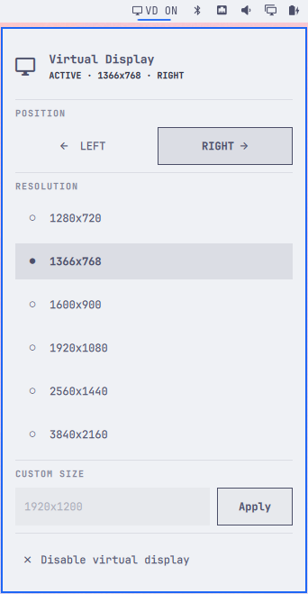
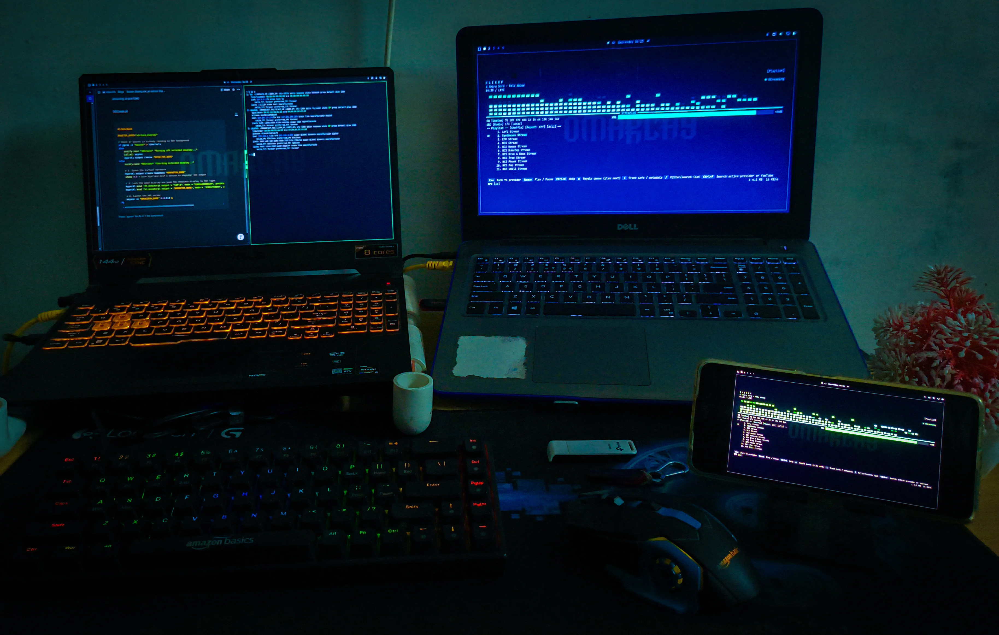

# omarchy-virtual-display

A lightweight Omarchy bar plugin for creating and managing a virtual headless display through Hyprland and WayVNC.

<div align="center">
<table align="center">
  <tr>
    <td width ="340px">
      
    </td>
    <td >
      
    </td>
  </tr>
</table>
</div>

## Use Your Virtual Display Anywhere

The virtual display can be accessed remotely through VNC from another computer, laptop, or Android device over a local Ethernet or Wi-Fi network.




## Features

- Create a virtual display from the Omarchy bar
- Preset resolutions
- Custom resolutions
- Place the virtual display to the left or right
- Automatically detect the main display
- Preserve the main display's resolution, scale and transform
- Automatically calculate the virtual display position
- Start and stop the WayVNC server
- Show active resolution and display side in the bar

## Requirements

This plugin is designed for **Omarchy Quattro / v4** and requires:

- [Omarchy](https://omarchy.org/)
- [Hyprland](https://hyprland.org/)
- [WayVNC](https://github.com/any1/wayvnc)
- `jq`


Install the external dependencies with:

```bash
sudo pacman -S wayvnc jq
```

>[!NOTE]
>The plugin does **not** install system packages automatically.
>
> This keeps package installation and privileged system changes outside the plugin. The plugin only uses the dependencies when they are already installed.


## Install

```sh
omarchy plugin add https://github.com/adamya-gupta/omarchy-virtual-display.git --enable
```

PLUGIN ID: `io.github.adamya-gupta.virtual-display`

## Usage

Click the **Virtual Display** icon in the Omarchy bar.

The panel provides three main controls.

### Position

Choose: `LEFT` or `RIGHT`

### Resolution

The plugin includes several preset resolutions:

```text
1280x720
1366x768
1600x900
1920x1080
2560x1440
3840x2160
```

Selecting a resolution starts the virtual display using that resolution.

Changing to another resolution while the display is already running recreates it using the new resolution.

### Custom Resolution

You can enter any custom resolution in: `WIDTHxHEIGHT`

Examples:

```text
1920x1200
2560x1600
3440x1440
1600x1000
```
## 🌐 VNC / Connecting From Another Device

<div align="center">

</div>

The virtual display is streamed using [WayVNC](https://github.com/any1/wayvnc).

By default, WayVNC listens on TCP port **5900**

The plugin currently starts WayVNC with:

```bash
wayvnc -o virtual_display 0.0.0.0
```
Binding to `0.0.0.0` allows WayVNC to listen on the machine's network interfaces instead of only localhost.

### 1. Start the virtual display

From the Omarchy bar, choose a resolution. eg: `1920x1080`. Wait for the display to become active.

>[!TIP]
>You can also start it from the CLI:
>
>```bash
>bash ~/.config/omarchy/plugins/io.github.adamya-gupta.virtual-display/vdcreate.sh start 1920x1080
>```

### 2. Find the Omarchy machine's IP address

On the Omarchy machine, run:

```bash
hostname -I
```
or 

```bash
ip addr
```

For example: `192.168.1.42`

If multiple addresses are shown, use the address belonging to the network you want the other device to connect through.


### 3. Connect using a VNC client

>[!IMPORTANT]
>Both devices must be on the same network.

Use this address in your VNC client:

```text
<OMARCHY-IP>:5900
```

Then connect from another device using this ip , eg: `192.168.1.42:5900`

Your VNC client may also allow: `192.168.1.42` because port `5900` is the normal VNC default.

## CLI Usage

The same `vdcreate.sh` used by the bar can also be used directly from the terminal.

Change to the plugin directory:

```bash
cd ~/.config/omarchy/plugins/io.github.adamya-gupta.virtual-display
```

### Start

Start using the default resolution:

```bash
bash vdcreate.sh start
```

Start with a specific resolution:

```bash
bash vdcreate.sh start 1920x1080
```

Start on the left:

```bash
bash vdcreate.sh start 1920x1080 left
```

Start on the right:

```bash
bash vdcreate.sh start 1920x1080 right
```

### Stop

```bash
bash vdcreate.sh stop
```

### Toggle

```bash
bash vdcreate.sh toggle
```

The toggle command starts the virtual display if it is not running and stops it if it is running.

### Set the preferred side

Save `left` as the preferred side:

```bash
bash vdcreate.sh set-side left
```

Or:

```bash
bash vdcreate.sh set-side right
```

The preferred side is used when starting the display without explicitly specifying a side.

### Check status

```bash
bash vdcreate.sh status
```

## Configure

There is currently no separate plugin configuration file. Display settings are controlled from the bar panel or through the CLI.

### Bar placement

```bash
omarchy bar move io.github.adamya-gupta.virtual-display --section right
```

```bash
omarchy bar move io.github.adamya-gupta.virtual-display --section left
```

```bash
omarchy bar move io.github.adamya-gupta.virtual-display --section center
```
### Preferred side

The last selected side is remembered by the CLI backend.

You can also set it manually:

```bash
bash ~/.config/omarchy/plugins/io.github.adamya-gupta.virtual-display/vdcreate.sh set-side left
```
or:

```bash
bash ~/.config/omarchy/plugins/io.github.adamya-gupta.virtual-display/vdcreate.sh set-side right
```
### VNC configuration

The current plugin starts WayVNC on the default VNC port:

```text
5900
```

and binds it to:

```text
0.0.0.0
```

## Remove

```sh
omarchy plugin remove io.github.adamya-gupta.virtual-display
```
If the virtual display is currently active, stop it first:

```bash
bash ~/.config/omarchy/plugins/io.github.adamya-gupta.virtual-display/vdcreate.sh stop
```

## Troubleshooting

### `wayvnc` of `jq` is not found

Install it:

```bash
sudo pacman -S wayvnc jq
```

### The widget is visible but clicking it does nothing

Check the Omarchy shell log:

```bash
journalctl --user -b --no-pager | grep -iE 'quickshell|omarchy-shell|io.github.adamya-gupta.virtual-display'
```

Then restart the shell:

```bash
omarchy-restart-shell
```

Then restart/reopen the plugin.

### Virtual display is created but vnc is not working

Check whether WayVNC is listening

You can verify the port with:

```bash
ss -ltn | grep 5900
```

You can also check the process:

```bash
pgrep -a wayvnc
```

>[!NOTE]
>If another application is already using port `5900`, WayVNC may fail to bind.

### The main monitor changes position

Check:

```bash
hyprctl monitors
```

The main display should remain at `0x0`.

## 🧩 How It Works

The plugin consists of three main parts:

```text
BarWidget.qml
    │
    ├── Omarchy bar button
    │
    └── loads Panel.qml
             │
             ├── Resolution selector
             ├── Left / Right selector
             └── Custom resolution
                      │
                      ▼
               vdcreate.sh
                      │
             ┌────────┴────────┐
             │                 │
          hyprctl            wayvnc
             │                 │
             ▼                 ▼
       virtual monitor      VNC stream
```

`BarWidget.qml` is the Omarchy plugin entry point.

`Panel.qml` provides the interactive panel.

`vdcreate.sh` handles the actual Hyprland and WayVNC operations.

The plugin does not modify Omarchy's packaged shell files.

## 🖥️ Automatic Monitor Positioning

The plugin automatically detects the main display and calculates the logical monitor width using its current resolution and scale.

It reads the currently active main/system display configuration from Hyprland.

The main monitor is always anchored at `0x0` 

The virtual display is then positioned relative to it.

### Example

Suppose the main display is:

```text
Resolution: 1920x1080
Scale:      1.25
Position:   0x0
```

Hyprland positions monitors using their logical/scaled size, so the logical width is:

```text
1920 / 1.25 = 1536
```

Therefore, a virtual display placed on the right starts at:

```text
1536x0
```

For a `1366x768` virtual display placed on the left:

```text
-1366x0
```

The resulting layout is conceptually:

```text
LEFT

virtual_display       main display
      │                    │
      ▼                    ▼
┌────────────────┐  ┌──────────────────────┐
│                │  │                      │
│  Virtual       │  │      Main            │
│  1366x768      │  │      1920x1080       │
│                │  │                      │
└────────────────┘  └──────────────────────┘
      -1366x0              0x0
```

For the right side:

```text
main display       virtual_display
      │                    │
      ▼                    ▼
┌──────────────────────┐  ┌────────────────┐
│                      │  │                │
│        Main          │  │   Virtual      │
│      1920x1080       │  │   1366x768     │
│                      │  │                │
└──────────────────────┘  └────────────────┘
        0x0                  1536x0
```
>[!NOTE]
>This means changing the main monitor's scaling or resolution does not require manually updating the plugin's position calculations.


## License

This project is licensed under the MIT License.

See [LICENSE](LICENSE) for details.